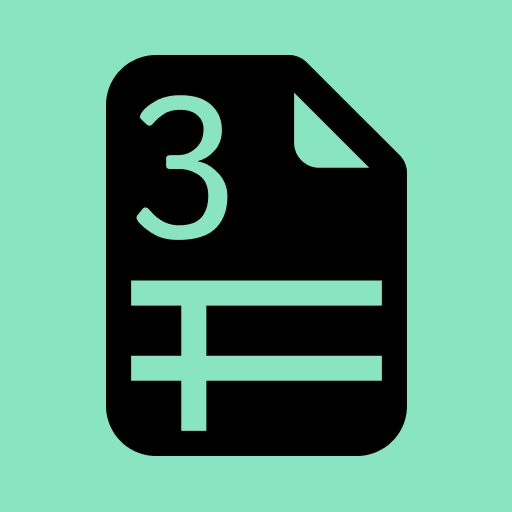

# Tax Bridg3



> **Generate crypto tax reports in your local currency, fast and easy.**

## What is Tax Bridg3?

Tax Bridg3 is a modern web application that helps you generate comprehensive reports for tax filing on your local currency, with seamless support for both individual and company data. Effortlessly manage your crypto transactions, integrate with leading blockchain APIs, and export ready-to-file reports.

- **Generate tax reports** for your crypto transactions
- **Export reports** with your company’s name and details
- **Integrate** with Etherscan, Coingecko, and more
- **PDF export** for easy sharing and filing
- **Modern, responsive UI** built with Next.js and Tailwind CSS

## Features

- **Blockchain Integrations:** Fetch data from Etherscan, Coingecko, and other APIs
- **Company Profile:** Add your company data for branded exports
- **Transaction Management:** View and manage your crypto transactions
- **PDF Report Generation:** Export your tax reports as PDFs
- **Local Currency Support:** Reports generated in your local currency
- **Local Storage:** We save data only loclStorage, and not send your company's data into mysterisous cloud ervers.

## Getting Started

### Prerequisites

- Node.js (v18+ recommended)
- Yarn or npm

### Installation

```bash
npm install
```

### Running the App

```bash
npm run dev
```

The app will be available at [http://localhost:3000](http://localhost:3000).

## Usage

1. **Connect your wallet or import transactions**
2. **Fill in your company profile** (optional, for company-branded exports)
3. **View and manage your transactions**
4. **Generate and export your tax report as a PDF**

## API Integrations

- [Etherscan](https://etherscan.io/)
- [Coingecko](https://coingecko.com/)
- [Supabase](https://supabase.com/)
- [Upstash Redis](https://upstash.com/)

## Technologies Used

- [Next.js](https://nextjs.org/)
- [React](https://react.dev/)
- [Tailwind CSS](https://tailwindcss.com/)
- [TypeScript](https://www.typescriptlang.org/)
- [PostCSS](https://postcss.org/)
- [Supabase](https://supabase.com/)
- [Upstash Redis](https://upstash.com/)
- [wagmi](https://wagmi.sh/)
- [viem](https://viem.sh/)
- [jspdf](https://github.com/parallax/jsPDF)

## Support

For support and advisory, contact: [central@novanet.hu](mailto:central@novanet.hu)

## License

Proprietary. Contact [central@novanet.hu](mailto:central@novanet.hu) for licensing information.
